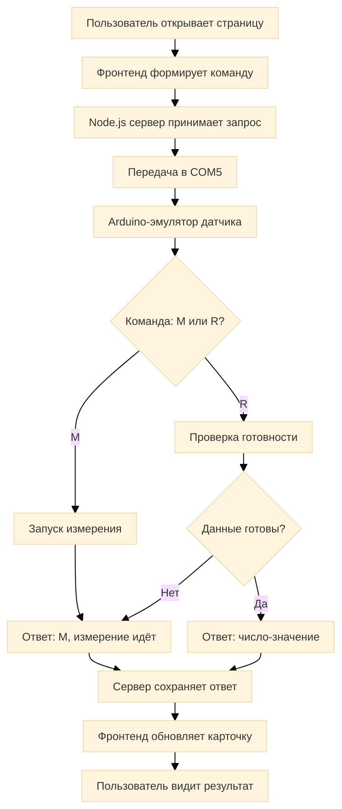

# Алгоритм работы проекта

## 1. Общая структура

Проект состоит из трёх частей:

- [index.html](index.html) — веб-интерфейс мониторинга датчиков.
- [server.js](server.js) — Node.js-сервер, который принимает HTTP-запросы и управляет обменом с COM-портом.
- [sensorEmu.ino](sensorEmu.ino) — эмулятор датчиков, работающий как Arduino-подобное устройство и отвечающий на команды по сериалу.

В целом проект реализует цикл:

1. Веб-страница запрашивает данные.
2. Сервер отправляет запросы на порт COM5.
3. Эмулятор датчиков обрабатывает команды.
4. Эмулятор возвращает ответ в формате `|NAME_NUM:VALUE;`.
5. Сервер сохраняет последний ответ.
6. Фронтенд показывает статус и значения датчиков.

## Блок-схема цикла работы



> Диаграмма максимально сжата под квадратный формат, чтобы помещалась без прокрутки.


---

## 2. Протокол обмена данными

Формат сообщений:

- `|` — начало кадра
- `:` — разделитель между именем датчика и значением/командой
- `;` — конец кадра

Пример:

- `|T0:M;` — запрос на измерение у датчика T0
- `|T0:R;` — запрос готовности данных
- `|T0:123;` — ответ датчика с результатом

Обозначения:

- `T` — твердость
- `P` — подуклон
- `G` — газ
- `D` — звук
- `0` или `1` — левый/правый датчик

Пример допустимой команды:

- `|T0:M;`
- `|P1:R;`
- `|G0:245;`

---

## 3. Как работает веб-интерфейс

Файл [index.html](index.html) содержит:

- 7 карточек датчиков:
  - T0, T1
  - P0, P1
  - G0
  - D0, D1
- блок ручного управления с полями:
  - `name` — тип датчика (`T`, `P`, `G`, `D`)
  - `num` — номер датчика (`0` или `1`)
  - `cmd` — команда (`M` или `R`)
- панель логов `#log`, в которой отображаются входящие и исходящие сообщения.

### 3.1. Функция `send()`

При нажатии кнопки выполняется:

1. Считываются данные из полей формы.
2. Формируется строка вида `|T0:M;`.
3. Отправляется POST-запрос на эндпоинт `/send`.
4. Сервер получает JSON и передаёт команду в COM-порт.

### 3.2. Таймер опроса

Раз в 300 мс JavaScript вызывает:

- `fetch('/response')`
- получает `latestResponse` с сервера
- сравнивает его с последним обработанным ответом
- если ответ новый, распознаёт его по регулярному выражению:

```js
/\|([TPGD])([01]):([MR\d]+);/
```

После распознавания:

- если значение равно `M`, состояние датчика становится `измерение...`
- если пришло число, состояние датчика становится `готово`
- если пакет не распознан, он игнорируется

---

## 4. Как работает сервер [server.js](server.js)

Сервер запускается на порту `3000` и выполняет несколько задач.

### 4.1. Инициализация COM-порта

При запуске создаётся объект `SerialPort`:

```js
const port = new SerialPort({
    path: 'COM5',
    baudRate: 115200,
});
```

Это означает, что сервер ожидает, что эмулятор/Arduino подключён на COM5.

### 4.2. Приём данных от порта

Когда приходит байт из последовательного порта:

1. Данные складываются в буфер `buffer`.
2. Если в буфере найден символ `|`, начинается поиск `;`.
3. Когда найден полный кадр, он сохраняется как `latestResponse`.
4. Сообщение парсится регулярным выражением `|([TPGD])([01]):([MR\d]+);`.
5. Если это сообщение относится к датчику, вызывает `handleAutoPoll(name, num, value)`.

### 4.3. Отправка команд в порт

Функция `sendCommand(name, num, cmd)` формирует строку:

```js
const command = '|' + name + num + ':' + cmd + ';';
port.write(command);
```

Это функция, через которую идёт отправка команд как с фронта, так и с автоматического опроса.

### 4.4. Автоопрос датчиков

Создан массив `pollQueue`:

```js
const pollQueue = [
    { name: 'T', num: '0', maxWait: 12000 },
    { name: 'T', num: '1', maxWait: 12000 },
    { name: 'P', num: '0', maxWait: 7000 },
    { name: 'P', num: '1', maxWait: 7000 },
    { name: 'G', num: '0', maxWait: 3000 },
    { name: 'D', num: '0', maxWait: 12000 },
    { name: 'D', num: '1', maxWait: 12000 },
];
```

Это очередь датчиков, которые опрашиваются по очереди.

#### Алгоритм автоопроса

1. `startPoll()` сбрасывает индекс `pollIndex`.
2. `pollNext()` выбирает текущий датчик из очереди.
3. Сервер шлёт команду `M` (измерить).
4. После `maxWait` запускается таймаут.
5. Если датчик вернул `M`, это значит, что он ещё занят и измерение не готово.
6. Сервер ждёт 500 мс и затем отправляет `R` — запрос готовности.
7. Если приходит число, это результат измерения.
8. После получения значения индекс очереди увеличивается.
9. Затем выполняется следующий датчик.

#### Почему это важно

Опрос идёт по очереди, потому что в описании эмулятора указано: "С НИМИ РАБОТАТЬ ПО ОЧЕРЕДИ, НЕЛЬЗЯ ПАРАЛЛЕЛЬНО!" То есть нельзя одновременно измерять несколько датчиков в одном цикле.

### 4.5. HTTP-эндпоинты

Сервер обрабатывает:

- `POST /send` — принимает команду из браузера и отправляет её на COM-порт.
- `GET /response` — отдаёт последний ответ `latestResponse` в JSON-формате.
- `GET /` или `GET /index.html` — отдает страницу интерфейса.
- `OPTIONS` — поддержка CORS для запросов браузера.

---

## 5. Как работает эмулятор датчиков [sensorEmu.ino](sensorEmu.ino)

В этом файле реализован "симулятор датчика" на языке Arduino/C++.

### 5.1. Протокол и система состояний

Используется перечисление `protocol_t`:

```cpp
typedef enum {
  WAIT,
  SEN_TYPE,
  SEN_NUM,
  COLON,
  COMMAND,
  END
} protocol_t;
```

Это состояние конечного автомата, который читает входящий поток байт по одному символу.

### 5.2. Парсер команд

Функция `parser(char c)` анализирует поток символов:

1. Ожидает `|`
2. Затем читает тип датчика: `T`, `P`, `G`, `D`
3. Затем считывает номер: `0` или `1`
4. Затем ожидает `:`
5. Затем читает команду:
   - `M` — start measurement
   - `R` — ready check
6. Затем ждёт `;` и завершает пакет.

Если команда корректна, начинается действие:

- при `M` вызывается `startMisure(curSenT)`
- при `R` вызывается `readSensor(curSenT)`

### 5.3. Цикл измерения

Для каждого типа датчика создаётся структура:

```cpp
typedef struct {
  char tChar;
  bool num;
  bool startMis;
  uint32_t minVal;
  uint32_t maxVal;
  uint32_t val;
  uint32_t tmout;
  uint32_t tmr;
} sen_obj;
```

Параметры:

- `tChar` — тип датчика (`T`, `P`, `G`, `D`)
- `num` — номер
- `startMis` — флаг, что измерение началось
- `minVal` / `maxVal` — диапазон значений
- `val` — текущее значение
- `tmout` — таймаут измерения
- `tmr` — время старта измерения

### 5.4. Функция `startMisure()`

Когда приходит команда `|T0:M;`, включается режим измерения:

```cpp
sensor[sen].tmr = millis();
sensor[sen].startMis = 1;
inMisure(sen);
```

После этого эмулятор отправляет назад:

```cpp
|T0:M;
```

Это означает: "Я принял запрос на измерение, ещё не готов".

### 5.5. Функция `readSensor()`

Когда приходит запрос `R`, функция проверяет:

- если прошло достаточно времени `millis() - sensor[sen].tmr >= sensor[sen].tmout`, то формируется случайное число в диапазоне и посылается ответ:

```cpp
|T0:456;
```

- если время ещё не прошло, датчик снова отвечает `M`, то есть "ещё измеряю".

### 5.6. Генерация значений

Значение вычисляется по формуле:

```cpp
sensor[sen].val = (uint32_t)((sensor[sen].val * 0.75) + (random(sensor[sen].minVal, sensor[sen].maxVal) * 0.25));
```

Это делает значения плавными и имитирует реальный датчик.

---

## 6. Полный цикл работы системы

### Сценарий 1: обычный автоматический опрос

1. Сервер запускает `startPoll()`.
2. Выбирается первый датчик из `pollQueue`.
3. Сервер вызывает `sendCommand(name, num, 'M')`.
4. Эмулятор получает `|T0:M;`.
5. Эмулятор запускает `startMisure()` и отвечает `|T0:M;`.
6. Сервер ждёт ответ и видит, что значение ещё не готово.
7. Через 500 мс отправляет `|T0:R;`.
8. Эмулятор проверяет таймер.
9. После истечения `tmout` эмулятор создаёт число и отправляет `|T0:234;`.
10. Сервер фиксирует ответ и переходит к следующему датчику.

### Сценарий 2: ручное управление через интерфейс

1. Пользователь вводит `T`, `0`, `M`.
2. Нажимает кнопку "Отправить".
3. `fetch('/send')` отправляет JSON на сервер.
4. Сервер вызывает `sendCommand('T', '0', 'M')`.
5. Команда идёт в COM5.
6. Эмулятор реагирует и возвращает результат в последовательный порт.
7. Сервер сохраняет `latestResponse`.
8. Интерфейс читает `/response` и обновляет карточку датчика.

---

## 7. Итог

Проект представляет собой простую систему мониторинга датчиков, где:

- веб-интерфейс отображает состояние датчиков,
- Node.js выступает как мост между браузером и COM-портом,
- Arduino-эмулятор моделирует датчики и их задержки,
- каждая команда и ответ проходят через компактный текстовый протокол.

Основная идея — обеспечить асинхронный цикл измерения, сериализацию данных и отображение состояния в реальном времени без сложной базы данных и без внешних библиотек.
