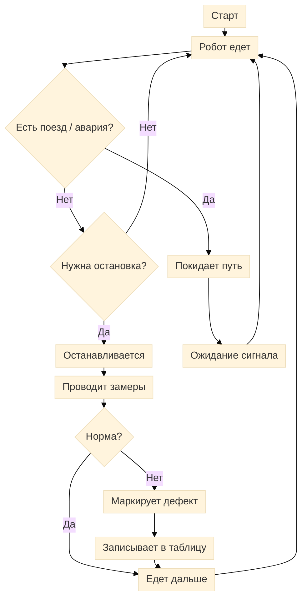

# Цикл работы робота

## Блок-схема

## Кратко

Робот едет по маршруту, но перед остановкой проверяет, нет ли поезда или аварийной ситуации. Если опасность есть, он покидает путь и переходит в безопасный режим. Если всё спокойно, он останавливается для замера, проверяет показатели, при норме продолжает движение, а при отклонениях маркирует дефект и записывает его в таблицу, затем снова едет дальше.
