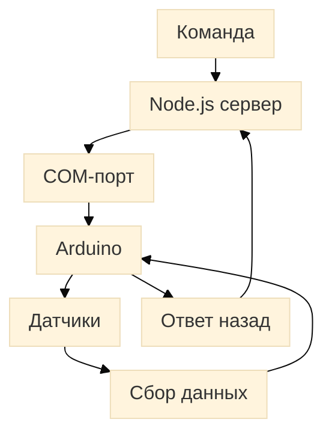

# Схема передачи сигнала

## Кратко

Команда поступает на сервер, затем передаётся через COM-порт на Arduino. Arduino отправляет сигнал датчикам, получает данные и возвращает ответ обратно по той же цепочке.
